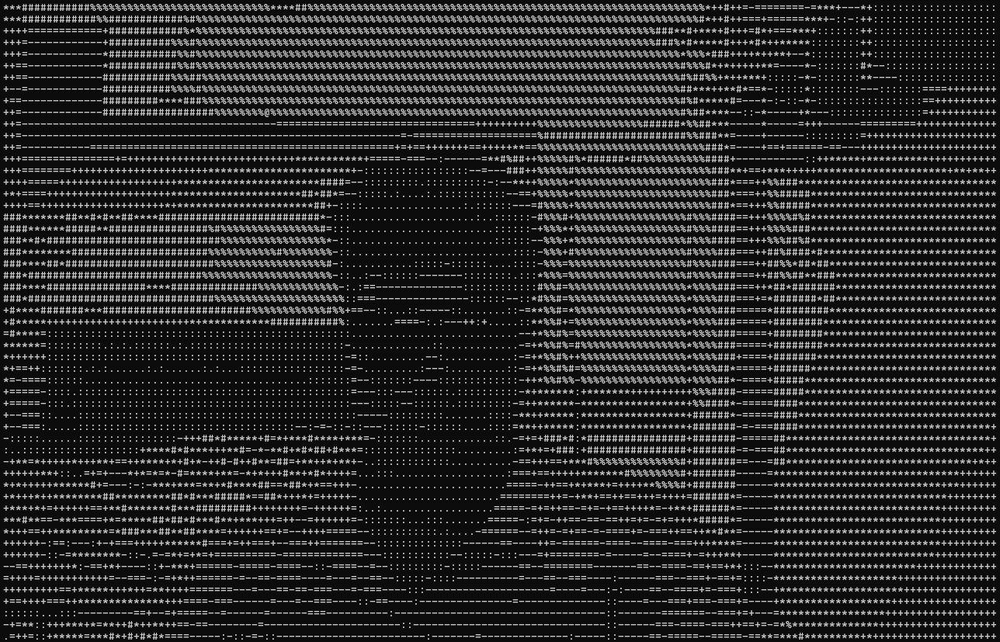
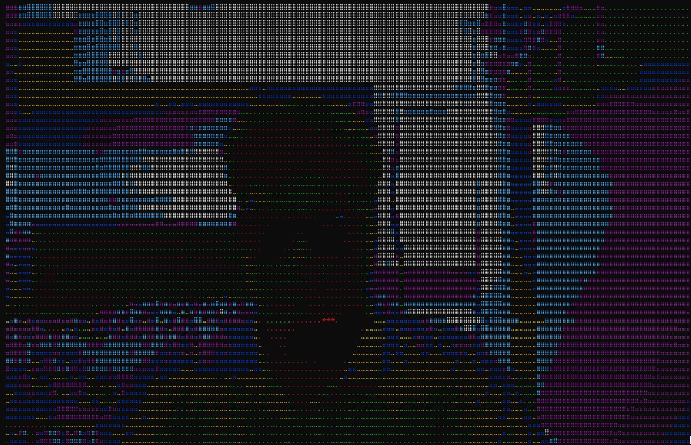

# 🎨 ASCII Camera 🎥

> **Turn your webcam into real-time ASCII art!**
> 
> 🖥️ Terminal display + 🕹️ Colorful GUI remote = Maximum fun!

---

## ✨ Features
- 🎬 **Live ASCII webcam** in your terminal (B&W or color, blazing fast)
- 🕹️ **Colorful GUI remote** for all controls (Tkinter, cross-platform)
- ✂️ **Crop selection** at startup (select any region of your webcam)
- 🎛️ **Real-time controls**: width, contrast, brightness, palette, color, rainbow, invert, face overlay, FPS
- 💾 **Save ASCII art** to text file or **save webcam image** with one click
- 🙂 **Face detection overlay** (toggle on/off)
- 🔤 **Multiple ASCII palettes** (classic, blocks, binary, etc.)
- 🔄 **Reset controls** to defaults at any time
- 🆘 **Help overlay** in GUI
- 📝 **Robust logging** for debugging

---

## 🚀 Installation

1. **Clone the repo:**
   ```sh
   git clone https://github.com/zanilyx/Terminal-ASCII-Webcam.git
   cd ascii_to_camera
   ```
2. **Create a virtual environment:**
   ```sh
   python -m venv venv
   source venv/bin/activate  # On Windows: venv\Scripts\activate
   ```
3. **Install requirements:**
   ```sh
   pip install -r requirements.txt
   ```
   (Tkinter is included with most Python installations.)

---

## 🏁 Usage

### Terminal + GUI Remote (Recommended)
```sh
python asciicam_terminal_gui.py
```
- The terminal displays the live ASCII webcam.
- The GUI window lets you control everything in real time.

### Terminal-Only (Advanced)
```sh
python asciicam.py
```
- All controls are via keyboard shortcuts (see below).

---

## 🕹️ Controls & Keybindings

### GUI Remote Controls
- **ASCII Width**: Adjust output width
- **Contrast/Brightness**: Fine-tune image
- **Palette**: Choose ASCII character set
- **Color Mode**: Toggle color ASCII
- **Rainbow**: Fun rainbow color mode
- **Invert Palette**: Reverse ASCII density
- **Face Overlay**: Highlight faces
- **Save ASCII**: Save current frame as text
- **Save Image**: Save current webcam image
- **FPS**: Show/hide stats in terminal
- **Reset Controls**: Restore all controls to defaults (crop unchanged)
- **Help**: Show help overlay
- **Quit**: Exit both GUI and terminal

### Terminal Keybindings (asciicam.py)
- `q`: Quit
- `c`: Toggle color mode
- `f`: Toggle FPS display
- `r`: Toggle rainbow/heatmap color mode
- `w`: Auto width to terminal size
- `s`: Save ASCII art to text file
- `p`: Save cropped webcam image as PNG/JPG
- `i`: Invert ASCII palette
- `a`: Next ASCII palette
- `t`: Toggle face detection overlay
- `[`: Decrease contrast
- `]`: Increase contrast
- `{`: Decrease brightness
- `}`: Increase brightness
- `+/-`: Increase/decrease ASCII width
- `h`: Toggle help overlay

---

## ✂️ Cropping & 🔄 Reset
- **Crop selection**: At startup, select a region to crop from your webcam (or use full frame).
- **Reset Controls**: In the GUI, resets all controls to defaults (does not affect crop).

---

## 🖼️ Example Outputs

### Classic B&W


### Color Mode


---

## 🛠️ Troubleshooting & FAQ
- **Webcam not found?** Make sure no other app is using it. Try changing the camera index in the code if you have multiple cameras.
- **GUI not showing?** Tkinter must be installed (comes with most Python installs).
- **Color mode slow?** Use a smaller ASCII width, or disable color/rainbow for best performance.
- **Reset not working?** Only resets controls, not crop. Restart the app to re-crop.
- **Face detection not working?** Requires OpenCV's haarcascade XML (should be included).

---

## 📜 License
MIT License. See LICENSE file.

## 🙏 Credits
- ASCII art logic: inspired by classic terminal art
- GUI: Tkinter
- Webcam: OpenCV
- Color: colorama
- Face detection: OpenCV haarcascade

---

**Enjoy your ASCII camera!** 😸 
